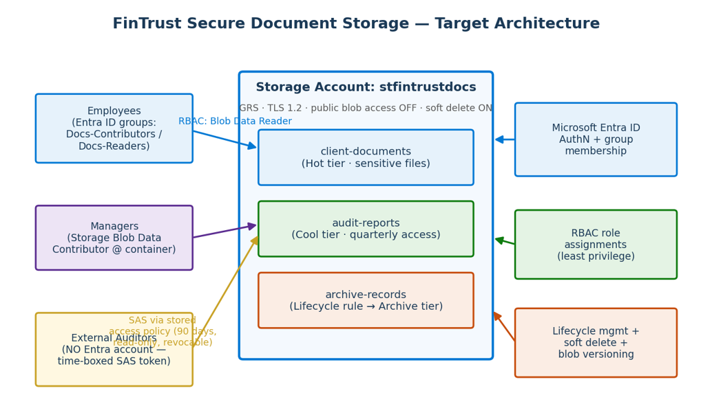

# fintrust-secure-storage

Migrated a financial services firm's document storage to Azure with geo-redundant storage, least-privilege RBAC, and revocable time-boxed auditor access via stored access policies.

## The Problem
Picture a mid-sized financial services firm. KYC records, loan files, and quarterly audit reports - the most sensitive documents the business owns - living on employee laptops and shared USB drives.

The damage was predictable, and it happened:

1. A laptop failure destroyed the only copy of several loan files.
2. A junior staff member turned out to have access to high-net-worth client records completely unrelated to their role.
3. Every quarter, audit documents were emailed to external auditors as attachments - and copies still sit in those auditors' inboxes today, unrecoverable.

## Architecture diagram


## Requirements → Solution
| Ref | Requirement | Azure Solution |
|-----|-------------|----------------|
| R1 | Survive datacenter failure | GRS redundancy |
| R2 | Role-based staff access | Entra ID groups + Blob Data roles at container scope |
| R3 | External auditor, no account, revocable | Service SAS + stored access policy |
| R4 | Auditors read-only | Policy grants Read + List only |
| R5 | Deletion and overwrite recovery | Soft delete (14 days) + blob versioning |
| R6 | 7-year retention, cost-optimised | Lifecycle rule: Cool → Archive → Delete |
| R7 | No anonymous access, encrypted transit | Anonymous access disabled, HTTPS-only, TLS 1.2 |
| R8 | Proactive spend alert | Budget: 80% actual + 100% forecasted |

## Key decisions
- **GRS over LRS/ZRS:** LRS keeps three copies in one datacenter — a single facility failure wipes everything. ZRS spreads across availability zones in one region but doesn't survive a regional outage. GRS replicates asynchronously to a paired region, giving the client document survival across a regional disaster at a cost point the budget supports.

- **Stored access policy over ad-hoc SAS:** An ad-hoc SAS cannot be revoked — it lives until expiry, and the only kill switch is rotating the account keys, which destroys every other SAS and keyed application in the account simultaneously. A stored access policy makes the SAS reference a named object on the container; deleting that object kills every token built on it instantly, with zero impact on staff access or other credentials.

- **Container scope over account scope for RBAC:** Assigning roles at account scope grants access to every container — past, present, and future. Scoping to the container means the Readers and Contributors groups have exactly one container's worth of permissions; a new container added tomorrow is invisible to them by default. Least privilege holds even as the storage account grows.

- **Service SAS over user delegation SAS:** User delegation SAS is signed with an Entra identity and caps at approximately seven days validity — incompatible with a 90-day auditor window. It also cannot reference a stored access policy, which means no revocation path. Service SAS, signed with the account key, supports both stored access policies and arbitrary expiry windows, making it the only mechanism that satisfies R3 and R4 together.

## Rebuild from scratch 
### Clone the repo
```git clone https://github.com/promibe/fintrust-secure-storage.git```

```cd fintrust-secure-storage/scripts```

### Phase 1: Foundation
bash 01-foundation.azcli

### Phase 2: Staff access
bash 02-rbac.azcli

### Phase 3: Auditor access
bash 03-sas-policy.azcli

### Phase 4: Lifecycle policy
```az storage account management-policy create \```

```  --account-name stfintrustdocs \```

```  --resource-group rg-fintrust-prod \```

```  --policy @lifecycle-policy.json```


## Teardown
bash
```az group delete -n rg-fintrust-prod --yes```

## Links
Follow the links below for the full write-up and project walkthrought

📝 Full write-up: https://medium.com/@promiseibediogwu1/i-gave-an-external-auditor-90-days-of-access-to-financial-documents-with-a-kill-switch-cc97a9310700

🎬 Walkthrough: [Loom link]

